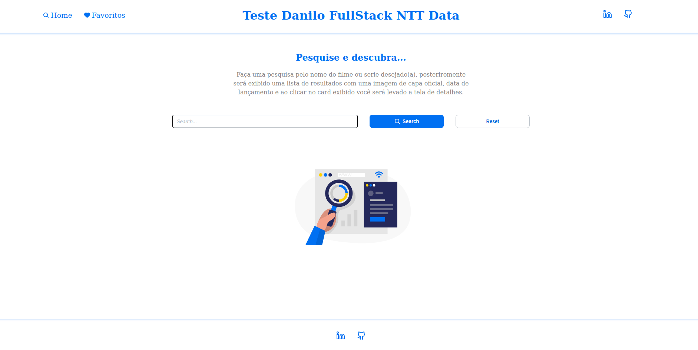
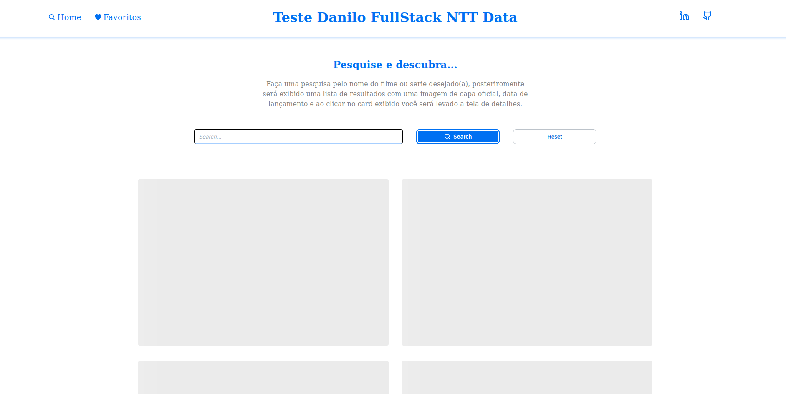
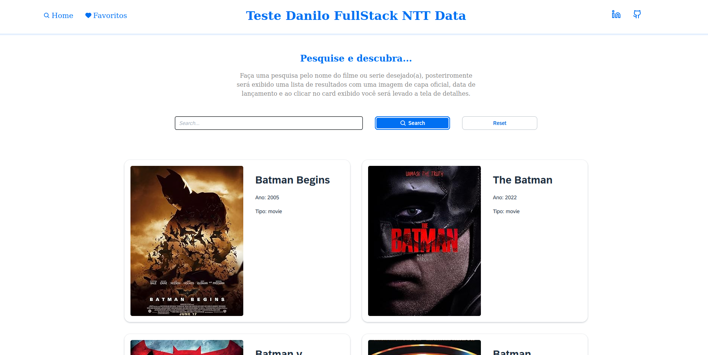
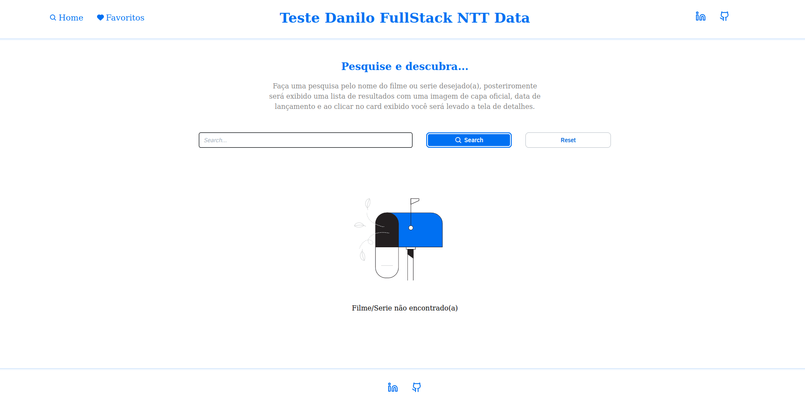
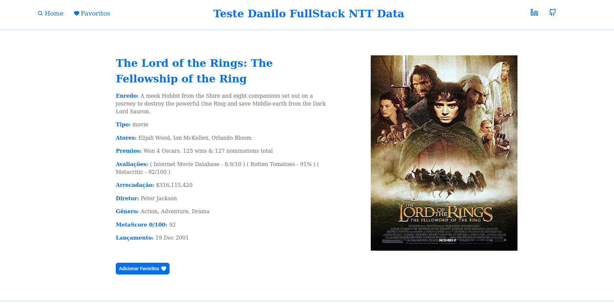
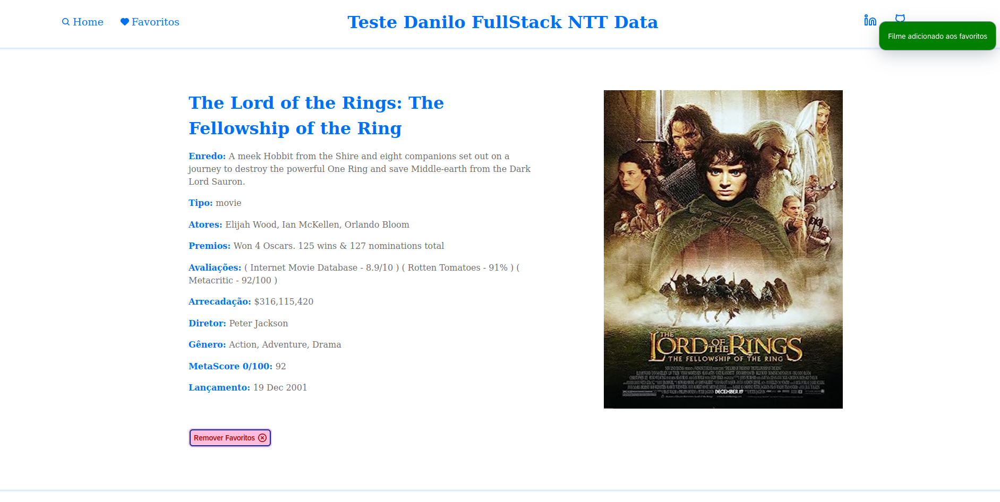
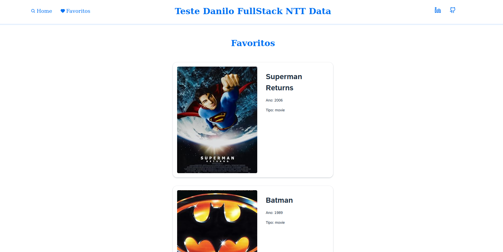
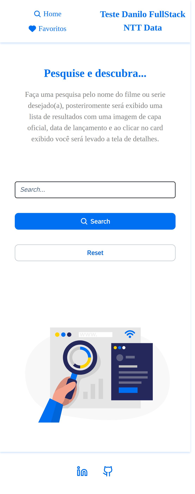
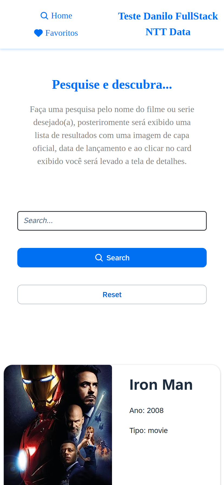
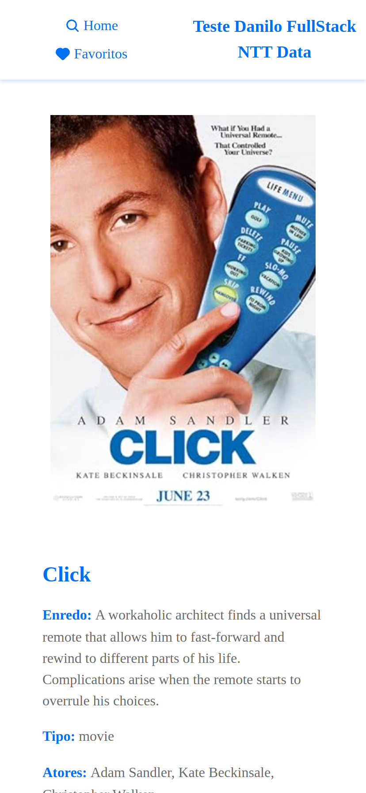

# nttdata-danilo-test

This is a test for fullstack developer in NTT Data made in 4 days.

This is a fullstack application built with the fammous NESTJS + REACT combo. It' is a simulation for a search movie website, with some simple feature such as favorite a film or a serie.

## Front-end

The front-end of this application is developed using:

- Vite: a fast build tool for modern web development.
- React: a popular JavaScript library for building user interfaces (SPA approach).
- UI5 Web Compenents: a SAP components library.
- SASS: a SCSS aproach, in other words, it's CSS with superpower.
- React Query: a library for fetching and managing async data in React applications.

## Back-end

The back-end of this application is developed using:

- Node.js: a JavaScript runtime for server-side development.
- NestJS: A progressive Node.js framework for building efficient, reliable and scalable server-side applications.

## Getting Started

> :warning: **WARNING **: This monorepo requires Docker and Docker Compose installed before proceeding.

To get started with this project, follow the steps below:

1. Clone the repository.

```bash
git clone https://github.com/Danilo-Guedes/nttdata-danilo-test.git
```

2. cd into the project folder.

```bash
cd nttdata-danilo-test
```

3. run the docker compose to initiate the application.

```bash
docker-compose up --build
```

4. Open the browser at http://localhost:5173/ (default port for vite apps) and use the application.

## What I would do if I had more time ?

1. Write tests for the application.
2. Add small animation to make the UI and UX even more friendly.

## Screenshots





















## License

This project is licensed under the [MIT License](LICENSE).
